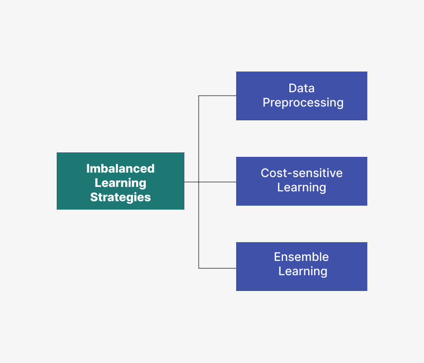
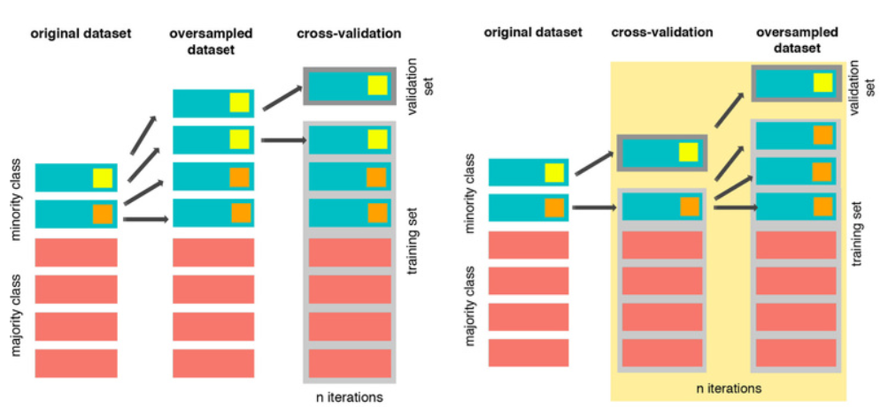

# Credit Card Fraud Detection Using Machine Learning on Highly Unbalanced Data

## Introduction

Credit card fraud detection is critical for financial security. This project explores the use of machine learning techniques to identify fraudulent transactions in highly imbalanced datasets. The dataset, provided by Worldline and the Université Libre de Bruxelles, includes 284,807 transactions, with only **0.172%** labeled as fraudulent. This extreme imbalance poses significant challenges for model training and evaluation. 

Through advanced techniques such as cost-sensitive learning, resampling methods, and ensemble classifiers, this project aims to address these challenges. Evaluation metrics focus on F1 Macro scores, Precision, Recall, and Precision-Recall Area Under Curve (PRAUC) to ensure robust performance.

## Table of Contents
1. [Features](#features)
2. [Installation](#installation)
3. [Methodology](#methodology)
4. [Experiments and Results](#experiments-and-results)
5. [Conclusions](#conclusions)
6. [Future Directions](#future-directions)
7. [Contributors](#contributors)
8. [License](#license)

## Features
- **Dataset preprocessing**: Handles PCA-transformed numerical features (V1 to V28) while retaining raw `Time` and `Amount` features for analysis.
- **Techniques for handling imbalanced data**:
  - **Undersampling**: Reduces the majority class to balance the dataset but risks losing critical information. *RandomUnderSampler & ClusterCentroids*
  - **Oversampling**: Augments the minority class using synthetic techniques like *SMOTE* and *ADASYN* to enhance balance.
  - **Combination methods**: *SMOTEENN* combines oversampling with noise reduction from undersampling.
  - **Cost-sensitive learning**: Adjusts the model's focus on minimizing misclassification costs for the minority class.
- **Evaluation**: Uses *F1 Macro*, *Precision-Recall* Curves, and *PRAUC* to assess performance under imbalance.

## Installation
1. Clone the repository:
   ```bash
   git clone https://github.com/mserra0/Credit-Card-Fraud-Detection.git
   cd credit-card-fraud-detection
   ```
2. Install the required dependencies:
   ```bash
   pip install -r requirements.txt
   ```

## Methodology

<p align="center">
 

### Exploratory Data Analysis (EDA)
The project begins with a comprehensive analysis of the dataset:
- **Temporal Analysis**: Identifies patterns in transaction timing that correlate with fraud.
- **Transaction Amounts**: Investigates whether fraudulent transactions are associated with specific ranges of transaction amounts.
- **Outlier Analysis**: Retains and studies outliers due to their relevance in fraud detection.

### Techniques for Imbalanced Data
1. **Undersampling**:
   - Methods such as **RandomUnderSampler** and **Cluster Centroids** are used to reduce the size of the majority class.
   - Limitations: Loss of valuable information leads to reduced performance (e.g., F1 Macro of 0.537 with KNN and RandomUnderSampler).

2. **Oversampling**:
   - **SMOTE (Synthetic Minority Oversampling Technique)**: Creates synthetic examples by interpolating between nearest neighbors of the minority class.
   - **ADASYN (Adaptive Synthetic Sampling)**: Enhances SMOTE by generating more samples for harder-to-classify instances.
   - Results: Significant performance improvement (F1 Macro of 0.924 with Random Forest and SMOTE).

3. **Combination Sampling**:
   - **SMOTEENN**: Combines *SMOTE* with *Edited Nearest Neighbors* (ENN), which removes noise from the majority class.
   - Results: Moderate success (F1 Macro of 0.91), though key fraudulent outliers may be removed, limiting further gains.

4. **Cost-Sensitive Learning**:
   - Models like Random Forest, Logistic Regression, KNN, and XGBoost are modified to weigh the cost of misclassifying the minority class.
   - A **Voting Classifier**, combining the best-performing models, yielded the highest performance:
     - *F1 Macro*: 0.938
     - *PRAUC*: 0.86
     - *Accuracy*: 99.9%

## Experiments and Results
- **Undersampling**: Effective for simplifying data but suffered from overfitting due to loss of information.
- **Oversampling**: SMOTE and ADASYN demonstrated strong performance with Random Forest and XGBoost.
- **Combined Sampling**: SMOTEENN showed promise but was less effective than standalone SMOTE in some cases.
- **Cost-Sensitive Learning**: The Voting Classifier surpassed all other models with a recall of 0.785 and high precision (92.7%).

It is important to note that resampling the minority class before cross-validation can cause overfitting, as it risks creating synthetic or duplicate samples that overlap between training and validation sets. This undermines the integrity of cross-validation, leading to overly optimistic and misleading results. To avoid this, resampling should be performed within each cross-validation fold, ensuring synthetic data is generated exclusively from the training set without contaminating the validation set.  

<p align="center">
  
</p>
<p align="center">
  <em>Image source: <a href="https://www.marcoaltini.com/blog/dealing-with-imbalanced-data-undersampling-oversampling-and-proper-cross-validation">Marco Altini</a></em>
</p>

## Conclusions
The project demonstrates the importance of balancing techniques in fraud detection for imbalanced datasets. The Voting Classifier with cost-sensitive learning proved to be the most effective approach, achieving:
- High precision and accuracy in identifying fraudulent transactions.
- Robust performance across various metrics (F1 Macro: 0.938).
  
However, the recall metric remains an area for improvement, indicating that some fraud cases remain undetected. This highlights the complexity of detecting sophisticated fraud patterns, which may closely mimic legitimate transactions.

The study underscores the need for a careful trade-off between precision and recall to ensure both high detection rates and minimal false positives.

## Future Directions
1. **Model Specialization**:
   - Develop models tailored to specific fraud types.
   - Integrate semi-supervised or unsupervised methods, such as autoencoders, to detect anomalies.
2. **Enhancing Interpretability**:
   - Improve feature transparency for clearer insights into fraud detection.
3. **Robustness Improvements**:
   - Expand experiments with different data augmentation and preprocessing techniques.
   - Investigate adversarial training to counter sophisticated fraud techniques.

## Contributors
- **Marc Serra Ortega** - Universitat Autònoma de Barcelona (UAB)
  
## License
This project is licensed under the [MIT License](LICENSE).
